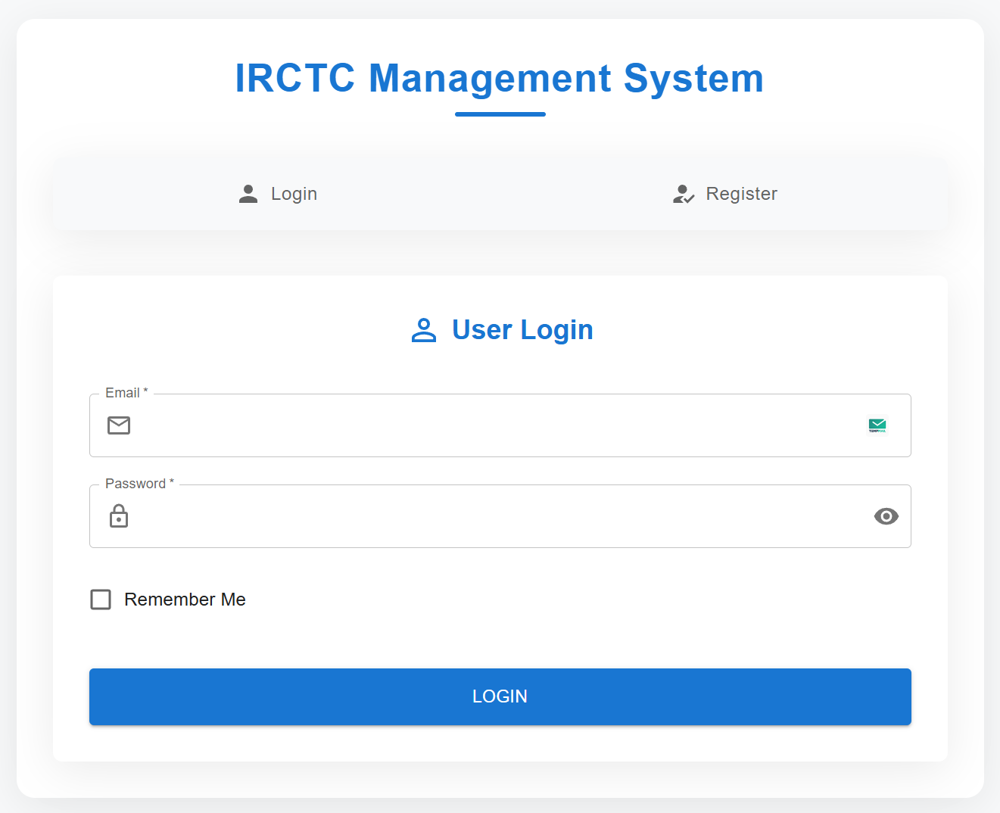
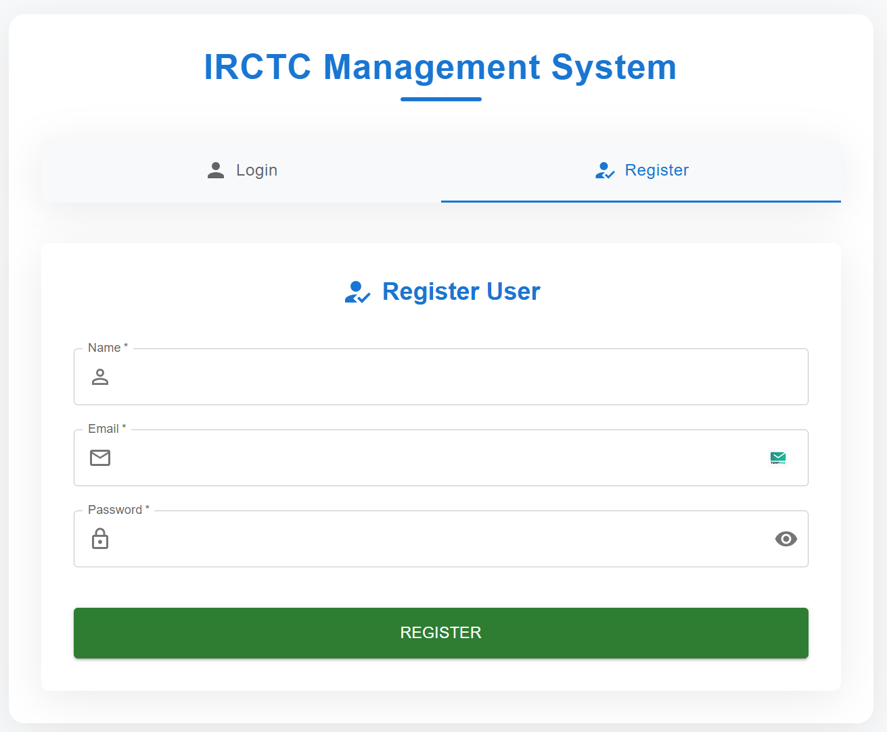
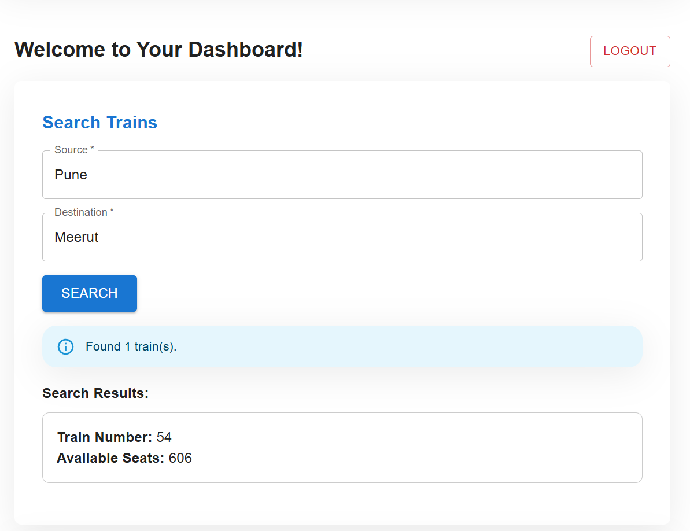
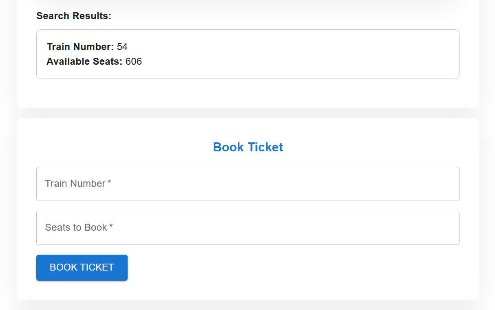
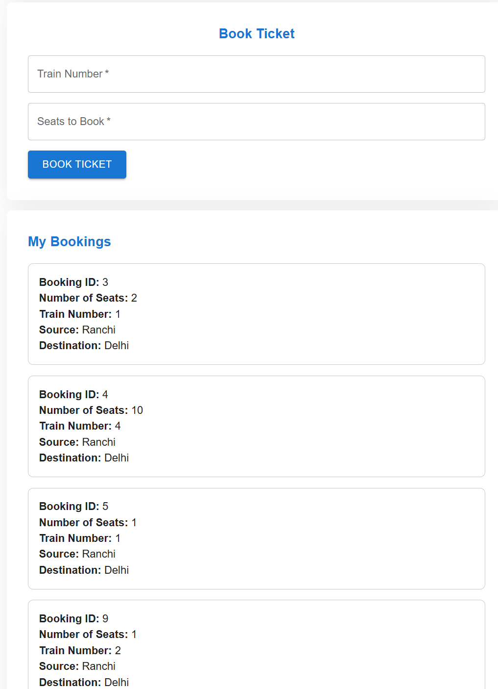

# IRCTC Management System

## Problem Statement

Hey there, Mr. X. You have been appointed to design a railway management system like IRCTC, where users can come on the platform and check if there are any trains available between 2 stations. The app will also display how many seats are available between any 2 stations and the user can book a seat if the availability > 0 after logging in. Since this has to be real-time and multiple users can book seats simultaneously, your code must be optimized enough to handle large traffic and should not fail while doing any bookings.
If more than 1 users simultaneously try to book seats, only either one of the users should be able to book. Handle such race conditions while booking.
There is a Role Based Access provision and 2 types of users would exist :

1. Admin - can perform all operations like adding trains, updating total seats in a train, etc.
2. Login users - can check availability of trains, seat availability, book seats, get booking details, etc.

---

## Features

This project manages core IRCTC-like functionalities:
• Listing available trains between two stations
• Checking seat availability
• Booking seats (with concurrency/locking in mind)
• Differentiating user roles (admin vs. regular users)

It’s divided into two main parts: a server (back-end APIs and authentication) and a client (front-end interface) to provide a smooth user experience.

---

## Screenshots

1. 
2. 
3. 
4. 
5. 

---

## Project Setup

### Prerequisites

To run this project, ensure you have the following installed:

- [Node.js](https://nodejs.org/en/) (v14 or later)
- [MySQL](https://www.mysql.com/) (Database setup)
- [Postman](https://www.postman.com/) (for Admin Actions testing)

### Environment Variables

You need to create a `.env` file in the root of your project with the following environment variables:

```bash
PORT=3000
DB_HOST=localhost
DB_USER=root
DB_PASSWORD=yourpassword
DB_NAME=irctc_db
JWT_SECRET=your_jwt_secret(random string of alphanumeric)
API_KEY=your_admin_api_key(random string of alphanumeric)
```

### Installation

1. Clone the repository to your local machine:
   ```bash
   git clone gh repo clone Kedar355/irctc-management-system
   cd irctc-management-system
   ```
2. Install all necessary dependencies using npm:

   ```bash
    npm install
   ```

3. Set up your MySQL database:

- Create a MySQL database named irctc_db.
- Run the SQL scripts in database/schema.sql to create necessary tables (users, trains, bookings).

Example:

```bash
CREATE DATABASE irctc_db;
USE irctc_db;

CREATE TABLE users (
   id INT AUTO_INCREMENT PRIMARY KEY,
   name VARCHAR(255) NOT NULL,
   email VARCHAR(255) UNIQUE NOT NULL,
   password VARCHAR(255) NOT NULL,
   role ENUM('user', 'admin') DEFAULT 'user',
   created_at TIMESTAMP DEFAULT CURRENT_TIMESTAMP
);

CREATE TABLE trains (
   id INT AUTO_INCREMENT PRIMARY KEY,
   train_number VARCHAR(50) NOT NULL,
   source VARCHAR(255) NOT NULL,
   destination VARCHAR(255) NOT NULL,
   total_seats INT NOT NULL,
   available_seats INT NOT NULL,
   created_at TIMESTAMP DEFAULT CURRENT_TIMESTAMP
);

CREATE TABLE bookings (
   id INT AUTO_INCREMENT PRIMARY KEY,
   user_id INT,
   train_id INT,
   seats INT NOT NULL,
   FOREIGN KEY (user_id) REFERENCES users(id),
   FOREIGN KEY (train_id) REFERENCES trains(id)
);
```

### Starting the Server

Once the setup is complete, start the server using npm: (Make sure you have npm start script setup in your package.json)

```bash
npm start

```

#### Note :- By default, the server will run on port 3000. You can access the API at http://localhost:3000.

### API Endpoints (ONLY FOR ADMIN) (USERS CAN DIRECTLY ACCESS VIA FRONTEND INTERFACE)

#### Admin Routes

1.  Add a new train

    - HTTP Method :- POST
    - Endpoint :- http://localhost:3000/admin/addTrain

    - Request Body:

```bash
{
    "message": "Trains added successfully",
    "trainIds": [
        {
            "trainNumber": "172622",
            "trainId": 21
        }
    ]
  }
```

         * Headers :
             * x-api-key: Your admin API key which is stored in .env

2. Update seat availability

   - HTTP Method :- PUT
   - Endpoint :- http://localhost:3000/admin/update-seats/10
   - Request Body:

```bash
 {
  "totalSeats": 200,
  "availableSeats": 150
 }
```

       * Response:

```bash
{
  "message": "Seats updated successfully"
}
```

        * Headers:
            * x-api-key:  Your admin API key which is stored in .env

### Running Tests

You can test all the available APIs using Postman. The endpoints are well-structured and follow RESTful conventions.

```bash
[
  {
    "trainNumber": "1",
    "source": "Pune",
    "destination": "Delhi",
    "totalSeats": 300
  },
  {
    "trainNumber": "2",
    "source": "Mumbai",
    "destination": "Aurangabad",
    "totalSeats": 350
  },
  {
    "trainNumber": "3",
    "source": "Varanasi",
    "destination": "Mau",
    "totalSeats": 400
  },
  {
    "trainNumber": "4",
    "source": "Ranchi",
    "destination": "Delhi",
    "totalSeats": 500
  },
  {
    "trainNumber": "5",
    "source": "Aurangabad",
    "destination": "Solopur",
    "totalSeats": 600
  }
]
```

### Technologies Used

- Node.js: For backend logic
- Express.js: Web framework for building the RESTful API
- MySQL: Database for storing train, user, and booking data
- JWT: For authentication and authorization
- bcrypt: For hashing the passwords
- dotenv: For managing environment variables

### Future Enhancements

- Add frontend interface for Admin Processes like AddTrain , UpdateSeatCount etc.
